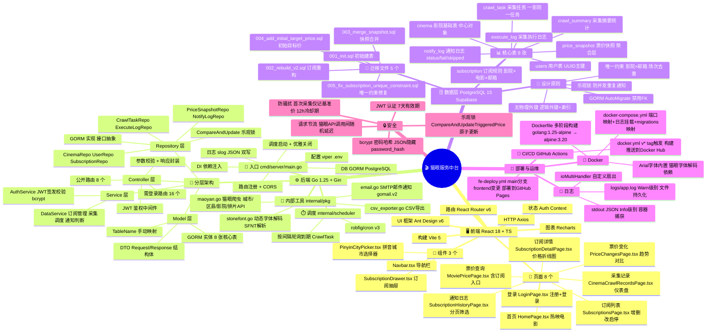
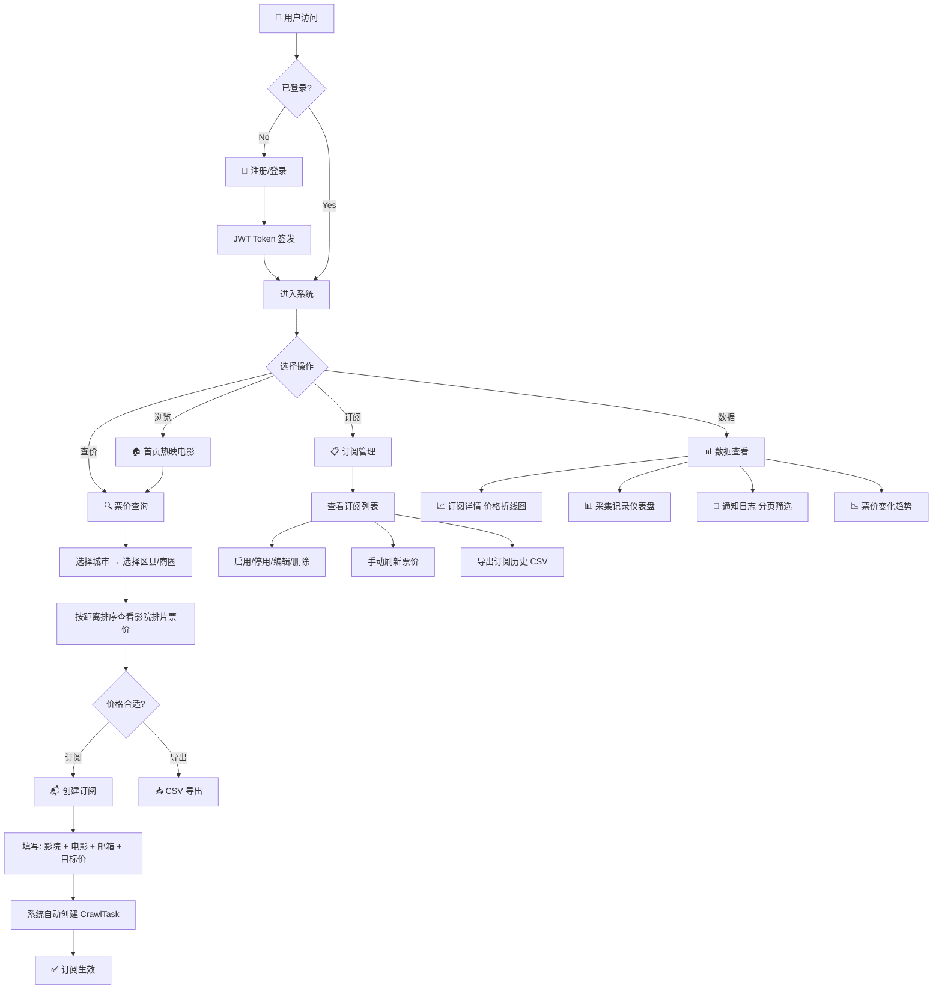
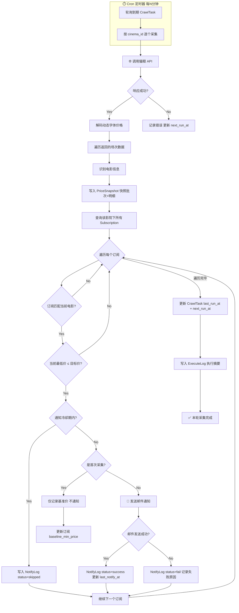
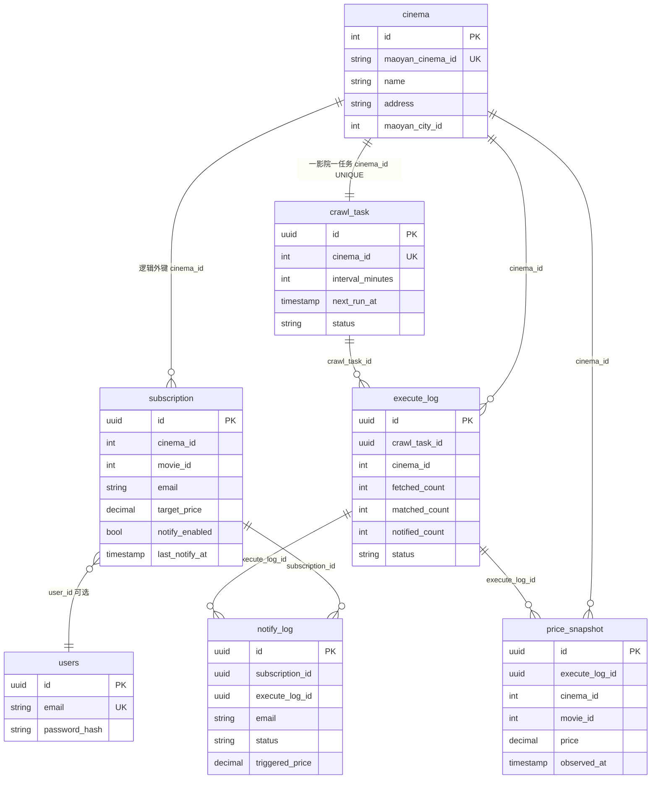
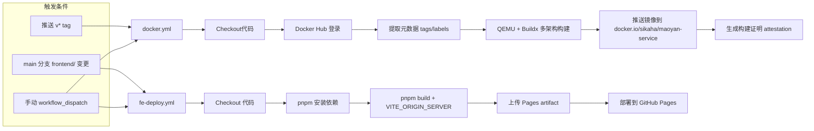

# 猫眼服务中台 — 架构思维导图 & 业务流程图

> 生成日期: 2026-08-12 | 基于最新代码结构

---

## 一、架构思维导图



---

## 二、业务流程图

### 2.1 用户核心流程



### 2.2 采集调度与通知流程



### 2.3 数据模型关系图



### 2.4 CI/CD 流水线



---

## 三、接口全景图

```
                    公开接口 (无需登录)
                    ─────────────────
GET  /health                     健康检查
POST /api/auth/register          注册
POST /api/auth/login             登录
GET  /api/cities                 城市列表(1094)
GET  /api/districts              区县+商圈
GET  /api/movies/hot             热映电影
GET  /api/movies/search          搜索电影
GET  /api/shows                  查询排片票价

                    需登录接口 (JWT Bearer)
                    ──────────────────────
POST   /api/subscriptions                创建订阅
GET    /api/subscriptions                订阅列表
GET    /api/subscriptions/:id            订阅详情+价格趋势
PATCH  /api/subscriptions/:id/toggle     启用/停用
PUT    /api/subscriptions/:id            更新订阅
DELETE /api/subscriptions/:id            删除订阅
GET    /api/subscriptions/logs           通知日志(分页+筛选)
GET    /api/subscriptions/cinemas        已订阅影院
GET    /api/subscriptions/cinema-movies  已订阅影院+电影
POST   /api/subscriptions/:id/refresh    手动刷新票价
GET    /api/subscriptions/:id/export     导出CSV
GET    /api/subscriptions/:id/crawl-records    采集记录仪表盘
GET    /api/subscriptions/:id/snapshots/:sid/shows  快照明细
GET    /api/shows/export                导出查询CSV
GET    /api/price-changes                票价变化趋势
POST   /api/admin/fetch                  全量采集(管理员)
POST   /api/admin/crawl/:cinema_id       单影院采集(管理员)
```
